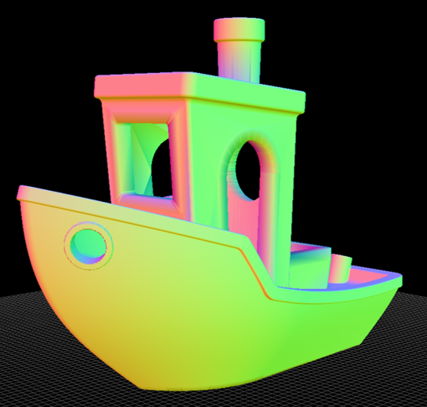

# Binary STL Viewer

This script provides a simple way to visualize binary STL files using `pyqtgraph`. It offers various rendering options based on user input and allows for customization of the viewing planes.




## Features

- Visualize binary STL files.
- Multiple rendering modes (plain, sharp, wireframe, transparent, shaded x-ray, edge-based, random colors).
- Customizable viewing planes to match specified dimensions.

## Requirements

- `Python 3.x`
- `pyqtgraph`
- `PyQt6`
- `numpy`

## Installation

To install the required packages, you can use `pip`:

```
pip install pyqtgraph PyQt6 numpy
```

## Usage

Running the script without arguments will prompt the user to enter a model filename:

```
python stlv.py
```

### Command-line Arguments

You can provide up to three additional arguments:

#### 1 Additional Argument `[Render]`

This disables the measuring planes and changes the render mode of the object. The options are:

- `1`, `"plain"`, or `other`: Renders the object in white.
- `2` or `"sharp"`: Renders the object in white without smoothing.
- `3` or `"wire"`: Renders the object as a wireframe.
- `4`, `"balloon"`, or `"xray"`: Renders a transparent version of the object relative to the current viewing angle
- `5`, `"shaded"`, or `"xrays"`: Renders a shaded x-ray.
- `6` or `"edge"`: Renders the object based on edges.
- `-1`: Randomizes face colors.

ex:
```
python stlv.py 3DBenchy 4
```

#### 2 Additional Arguments `[xBed] [yBed]`

This scales the xy plane to match the user-provided dimensions, which is useful for showing the object relative to a specific bed size.

ex:
```
python stlv.py 3DBenchy 70 80
```
plots the stl relative to a plane whose x dimension is 70, y dimension is 80

#### 3 Additional Arguments `[xBed] [yBed] [zBed]`

This adds the xz and yz planes for vertical height, allowing a more comprehensive view of the object's dimensions.

ex:
```
python stlv.py 3DBenchy 50 100 150
```
plots the stl relative to a plane whose x dimension is 50, y dimension is 100, and z dimension is 150

### Example

To run the script with specific dimensions and render options:

```
python stlv.py 3DBenchy.stl 120 120
```

Returns the image shown at the beginning

## Directions

- Rotate view using Mouse Button 1 (M1)
- Pan using Mouse Button 3 (M3)
- Zoom using scroll
- Arrow keys can also be used for navigation

## Disabling shader
For those that want a fast renderer, it is suggested to uncomment and comment lines 140-143 which disable the shaders

## Code Structure

### Functions

- `check_and_get_filename()`: Prompts the user for a filename if not provided via command-line arguments.
- `read_stl_file(filename)`: Reads the binary STL file and extracts the vertex data.
- `calculate_model_info(tri)`: Calculates the dimensions and minimum coordinates of the model.
- `create_grid(size, pos, rotation=None)`: Creates a grid item for the 3D view.

### Main Script

1. **File Checking and Reading**: Ensures the provided STL file exists and reads its content.
2. **Model Information Calculation**: Computes the dimensions of the model.
3. **Application Setup**: Initializes the `pyqtgraph` application and sets up the 3D view.
4. **Rendering Options**: Configures the rendering mode based on command-line arguments.
5. **Adding Model to View**: Adds the STL model to the 3D view with appropriate transformations.

## License

This project is licensed under the MIT License.

---
